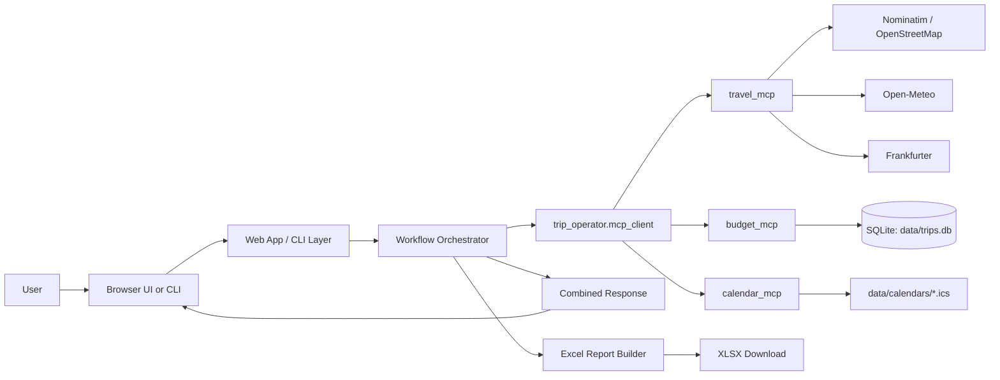
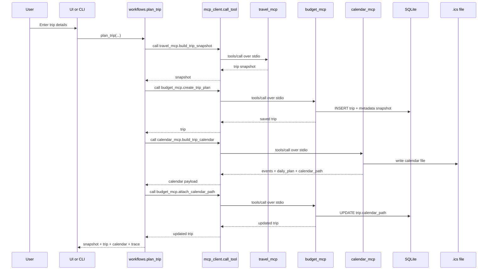
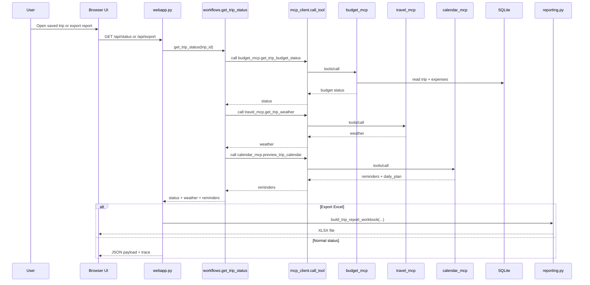

# Trip Budget Operator: How It Works

This document explains how the project is structured, what each MCP server does, how the parts talk to each other, and how the final output is produced.

## 1. What the project does

Trip Budget Operator is a small MCP-based application for planning and tracking a trip.

It combines three concerns:

- travel intelligence: destination lookup, weather, exchange rate, estimated costs
- budget tracking: saved trips, expenses, pace vs budget
- calendar planning: reminders, day-by-day plan, `.ics` export

The user can use either:

- the CLI through `main.py`
- the browser UI through `main.py ui`

The UI and CLI do not call MCP servers directly by themselves. They go through a workflow layer that orchestrates the MCP calls in order.

## 2. Main runtime path

### Entry points

- `main.py`
  - re-execs into the repo virtual environment when available
  - then calls `trip_operator.cli.main()`
- `trip_operator/cli.py`
  - handles commands like `plan`, `status`, `list-trips`, `add-expense`, `import-expenses`, and `ui`
- `trip_operator/webapp.py`
  - serves the browser UI and JSON API endpoints
  - delegates business actions to `trip_operator.workflows`

### Core orchestration

- `trip_operator/workflows.py`
  - coordinates the order of MCP tool calls
  - combines responses into the final payload returned to the CLI or UI

### MCP transport

- `trip_operator/mcp_client.py`
  - opens a fresh MCP `stdio` session for each tool call
  - launches the target MCP server as a subprocess with `python -m ...`
  - sends a `tools/call` request
  - extracts the structured result
  - records trace events for the UI

### Storage and artifacts

- `trip_operator/storage.py`
  - stores trips and expenses in SQLite
- `trip_operator/calendaring.py`
  - builds reminder events and a day-by-day plan
  - exports `.ics` files
- `trip_operator/reporting.py`
  - exports an Excel workbook with four sheets
- `trip_operator/config.py`
  - defines:
    - database: `data/trips.db`
    - calendar files: `data/calendars/*.ics`

## 3. The three MCP servers

The project has three MCP servers in `mcp_servers/`.

Important design point:

- the MCP servers do not call each other directly
- the client orchestration layer calls them one at a time in sequence

### `travel_mcp`

File: `mcp_servers/travel_server.py`

Purpose:

- build a live planning snapshot for a trip
- refresh weather for an existing trip

Main tools:

- `build_trip_snapshot`
  - geocodes destination and optional home city
  - gets weather if the trip is inside the supported forecast window
  - gets exchange rate when destination currency is not USD
  - estimates transport, lodging, food, local transit, and activities
  - calculates budget gap and planning tips
- `get_trip_weather`
  - refreshes the weather block for a trip
- `list_supported_destinations`
  - returns destinations with tuned local cost profiles

Underlying logic:

- implemented in `trip_operator/travel.py`
- uses:
  - Nominatim / OpenStreetMap for geocoding
  - Open-Meteo for weather
  - Frankfurter for exchange rates
- falls back gracefully where possible

### `budget_mcp`

File: `mcp_servers/budget_server.py`

Purpose:

- persist trip plans
- record expenses
- compute current budget status

Main tools:

- `create_trip_plan`
  - saves the trip and stores the travel snapshot inside `metadata_json`
- `record_expense`
  - saves one expense row
- `import_expenses_from_csv`
  - bulk imports expense rows from CSV
- `get_trip_budget_status`
  - reads trip + expenses
  - calculates total spent, remaining budget, category breakdown, and pace delta
- `list_saved_trips`
  - lists all stored trips
- `attach_calendar_path`
  - saves the generated `.ics` path back onto the trip row

Underlying logic:

- implemented in `trip_operator/storage.py`
- data is stored in SQLite:
  - `trips`
  - `expenses`

### `calendar_mcp`

File: `mcp_servers/calendar_server.py`

Purpose:

- generate reminders
- generate a suggested day-by-day activity plan
- export the result as `.ics`

Main tools:

- `preview_trip_calendar`
  - returns reminder events and `daily_plan` without writing a file
- `build_trip_calendar`
  - builds the same content and writes an `.ics` file

Underlying logic:

- implemented in `trip_operator/calendaring.py`
- uses the saved trip snapshot to create:
  - planning reminders before departure
  - daily spend checks
  - day-by-day itinerary suggestions
  - a post-trip reconciliation reminder

## 4. How the pieces talk to each other

The application uses a hub-and-spoke pattern.

- the UI or CLI sends one request to the app
- the workflow layer decides which MCP tools to call
- `mcp_client.py` launches the needed server process and talks to it over `stdio`
- results come back to the workflow
- the workflow merges them into one final payload

This means:

- there is no server-to-server communication
- the orchestration logic lives entirely in `trip_operator/workflows.py`
- every MCP call is explicit and traceable

## 5. Main workflow: create a trip

When the user creates a trip, the app runs this sequence:

1. UI or CLI sends trip details to the workflow layer.
2. `travel_mcp.build_trip_snapshot` builds the live travel estimate.
3. `budget_mcp.create_trip_plan` saves the trip and embeds the travel snapshot in SQLite.
4. `calendar_mcp.build_trip_calendar` generates reminders, the day-by-day plan, and the `.ics` file.
5. `budget_mcp.attach_calendar_path` saves the calendar file path onto the trip record.
6. The workflow returns one combined payload:
   - `snapshot`
   - `trip`
   - `calendar`

### What the final plan response contains

- destination and trip metadata
- weather summary
- estimated costs
- budget assessment
- tips
- saved trip record
- calendar file path
- reminder events
- daily itinerary plan

## 6. Main workflow: check trip status

When the user asks for trip status, the app runs this sequence:

1. `budget_mcp.get_trip_budget_status`
   - reads the trip
   - reads expenses
   - computes remaining budget and pace
2. `travel_mcp.get_trip_weather`
   - refreshes destination weather
3. `calendar_mcp.preview_trip_calendar`
   - rebuilds reminders and daily plan using the saved snapshot from SQLite
4. The workflow returns:
   - `status`
   - `weather`
   - `reminders`

This is why the status view can show budget data, weather, and calendar planning in one response even though they come from different servers.

## 7. Other workflows

### Add expense

- UI/CLI calls `workflows.add_trip_expense`
- workflow calls `budget_mcp.record_expense`
- result is saved in SQLite and returned immediately

### List trips

- UI/CLI calls `workflows.list_saved_trips`
- workflow calls `budget_mcp.list_saved_trips`

### Export Excel

- UI calls `/api/export?trip_id=...`
- web app calls `workflows.get_trip_status`
- `trip_operator/reporting.py` converts that combined status payload into a workbook with four sheets:
  - `Travel MCP`
  - `Budget MCP`
  - `Calendar MCP`
  - `Trip Detail`

## 8. Where the final output comes from

The final output shown in the UI is assembled from multiple layers:

- `travel_mcp`
  - destination, weather, estimates, budget assessment, tips
- `budget_mcp`
  - saved trip data, actual expenses, current budget status
- `calendar_mcp`
  - reminders, itinerary suggestions, `.ics` path
- `mcp_client`
  - MCP trace entries for the trace panel
- `reporting.py`
  - Excel export

The UI then renders that combined JSON into:

- summary cards
- MCP-specific panels
- expense table
- reminder timeline
- raw JSON
- MCP trace

## 9. Mermaid diagrams

You can paste these blocks into Mermaid Live Editor or render them in Markdown environments that support Mermaid.

### High-level architecture

### Trip planning sequence

### Status and export sequence

## 10. Key files to read in order

If you want to understand the project quickly, read these files in this order:

1. `main.py`
2. `trip_operator/cli.py`
3. `trip_operator/webapp.py`
4. `trip_operator/workflows.py`
5. `trip_operator/mcp_client.py`
6. `mcp_servers/travel_server.py`
7. `mcp_servers/budget_server.py`
8. `mcp_servers/calendar_server.py`
9. `trip_operator/travel.py`
10. `trip_operator/storage.py`
11. `trip_operator/calendaring.py`
12. `trip_operator/reporting.py`

## 11. Short summary

The project works because one client-side workflow layer coordinates three specialized MCP servers:

- `travel_mcp` figures out what the trip will likely cost and what conditions look like
- `budget_mcp` stores the trip and tracks actual spending
- `calendar_mcp` turns the trip into reminders and a day-by-day plan

They do not talk to each other directly.

The orchestrator talks to each server over MCP `stdio`, combines the results, and returns one final response for the UI, CLI, calendar export, and Excel export.
